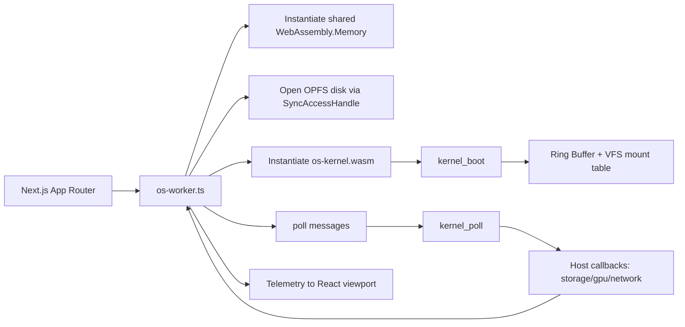

# Next-Gen WASM-Native OS in Next.js

## 1. Runtime Envelope

This project implements a Single Address Space OS model in the browser:

- Next.js App Router serves as delivery shell and observability plane only.
- WASM kernel runs inside dedicated workers with shared linear memory.
- OPFS (SyncAccessHandle) acts as low-level persistent block storage.
- WIT contracts describe host syscalls and kernel ABI.

Cross-origin isolation is mandatory for SharedArrayBuffer and wasm atomics.

## 2. Toolchain

- Next.js 14 app runtime with strict security headers.
- Rust target: wasm32-unknown-unknown with atomics/bulk-memory/shared-memory linker args.
- WIT definitions in os-kernel/wit/host.wit.
- Component assembly intended with:
  - wasm-tools
  - wit-bindgen
  - wit-component

Example setup commands:

```bash
rustup target add wasm32-unknown-unknown
cargo install wasm-tools
cargo install wit-bindgen-cli
```

## 3. Production Directory Layout

```text
.
├── os-kernel/
│   ├── Cargo.toml
│   ├── .cargo/
│   │   └── config.toml
│   ├── wit/
│   │   └── host.wit
│   ├── src/
│   │   ├── main.rs
│   │   ├── memory.rs
│   │   └── vfs.rs
│   └── drivers/
│       ├── storage/
│       ├── gpu/
│       ├── net/
│       └── README.md
├── src/
│   ├── app/
│   │   ├── globals.css
│   │   ├── layout.tsx
│   │   └── page.tsx
│   ├── components/
│   │   └── OsViewport.tsx
│   └── workers/
│       └── os-worker.ts
├── public/
│   └── wasm/
│       └── README.md
├── docs/
│   └── architecture.md
├── next.config.js
├── package.json
└── tsconfig.json
```

## 4. Boot and Scheduling Flow



## 5. Core Subsystems

### Bootloader (PID 1 role)

- Initializes shared ring regions in linear memory.
- Creates base VFS mount points (/dev, /sys, /net).
- Validates and mounts additional components from OPFS by checking WASM magic/version.

### Memory and Zero-Copy IPC

- Ring header and packet slots reside in shared linear memory.
- Producers and consumers use atomic read/write cursors.
- No JSON serialization in kernel path; messages are fixed-size structs.

### Driver HAL

- Storage syscall imports map directly to OPFS sync access handles.
- GPU submit import is wired for direct command stream pointers.
- Network interface is modeled in WIT for WebTransport/WebRTC driver components.

## 6. Delivery and Build Pipeline

1. Build kernel:

```bash
cargo build --manifest-path os-kernel/Cargo.toml --target wasm32-unknown-unknown --release
```

2. Copy kernel wasm to public payload path:

```bash
copy os-kernel\target\wasm32-unknown-unknown\release\os-kernel.wasm public\wasm\os-kernel.wasm
```

3. Run Next.js shell:

```bash
npm install
npm run dev
```

## 7. Constraint Notes

- Runtime still needs minimal JS for browser capability acquisition (Worker, OPFS, WebGPU handles).
- Data-plane work remains pointer-oriented in shared memory after bootstrap.
- No Emscripten or POSIX translation layer is used.
